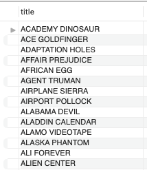

# Evaluación módulo 2 (SQL)

## Objetivo 
El archivo `evaluacion-final.sql` contiene una serie de pruebas por parte del profesorado de `Adalab` para evaluar los conocimientos una vez finalizado el `módulo 2` del Bootcamp de Data Analytics.

## Aspectos formales
- El archivo tiene extensión `.sql` 
- La base de datos utilizada es `Sakila`, una base de datos que simula una tienda de alquiler de películas.


## Prueba:
La prueba consiste en obtener la información pedida sobre de la base de datos de `Sakila`. A continuación se un ejemplo de información requerida durante la prueba:

### Ejemplo: 
Encuentra el título de todas las películas que fueron alquiladas por más de 5 días:

```sql
SELECT DISTINCT f.title
	FROM film AS f
	INNER JOIN inventory AS i
	USING(film_id)
	INNER JOIN rental
	USING(inventory_id)
WHERE rental_id IN (SELECT  rental_id
					FROM rental
					WHERE (DATE(return_date) - DATE(rental_date)) > 5)
```
Esta consulta nos devuelve una tabla cuyo comienzo es de la siguiente forma:




## Next steps:
- Crear un código más `eficiente` y `sencillo`.
- Generar `visualizaciones` atractivas e interactivas de los datos.
- Conectar la base de datos desde `Python` y realizar todas las consultas desde un `jupyter notebook`.


